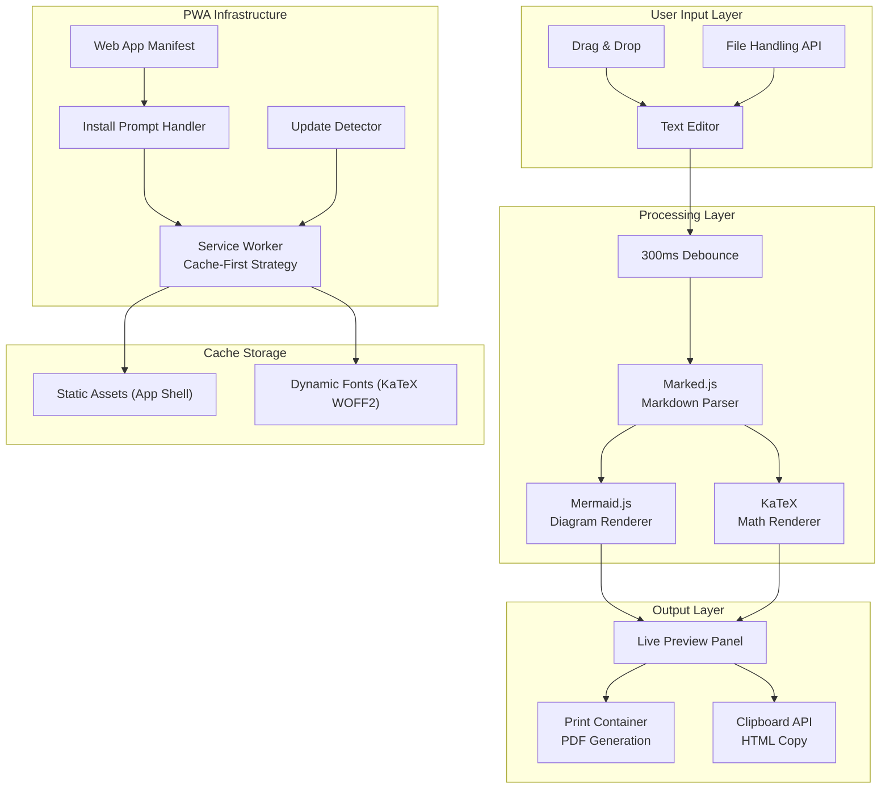
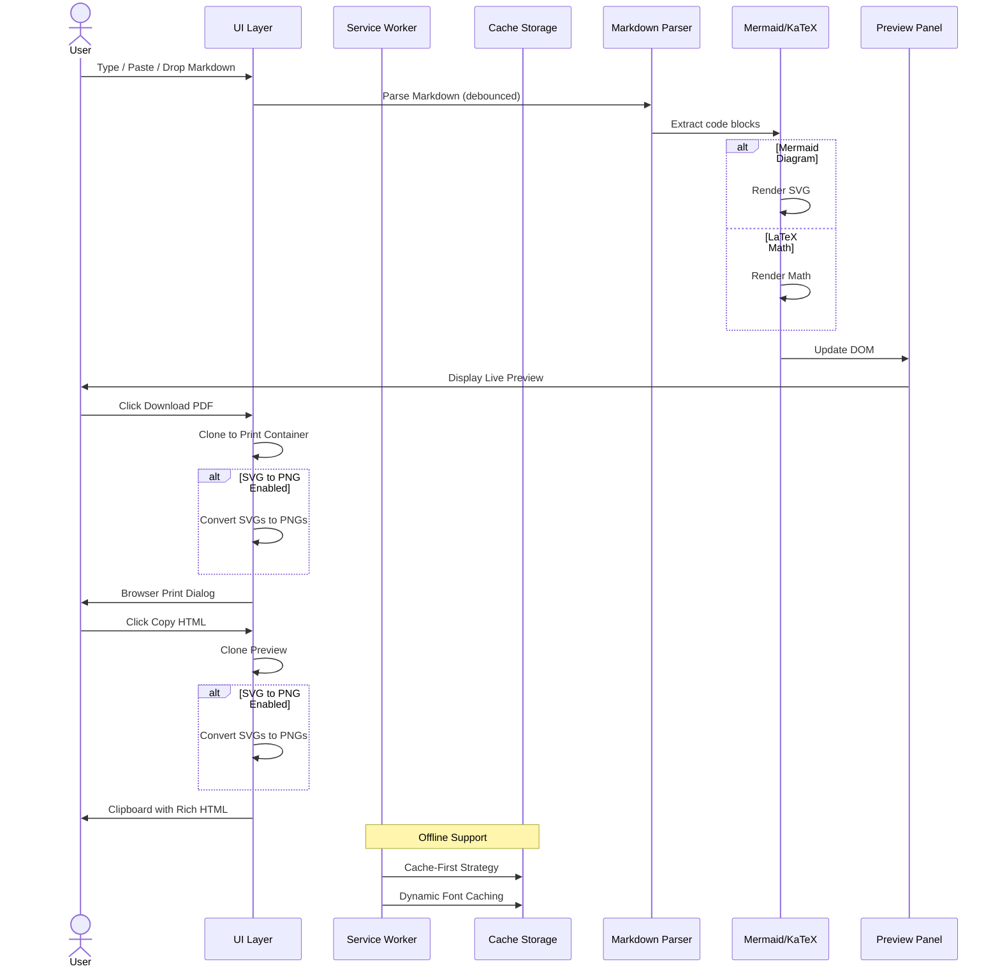
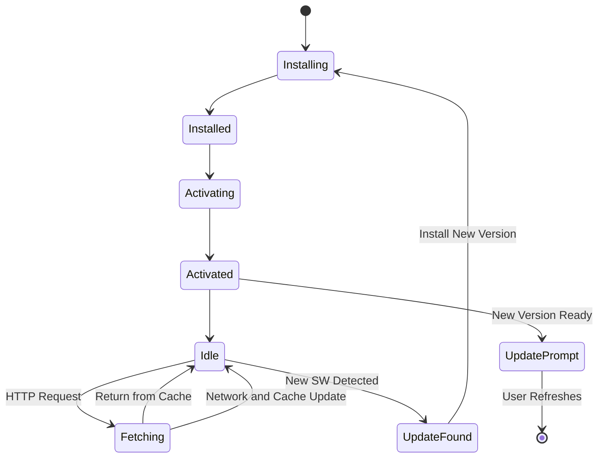

# mdpdf

Convert Markdown to PDF with Mermaid diagrams and LaTeX math support. A fully offline-capable, installable Progressive Web App (PWA).

## Features

### 💻 Core Functionality
- **Markdown to PDF Conversion** — Convert Markdown files to beautifully formatted PDF documents using the browser's print-to-PDF capability
- **Live Preview** — Real-time side-by-side preview updates as you type (300ms debounced)
- **Drag & Drop** — Drag Markdown files directly into the browser for instant editing (supports `.md`, `.markdown`, `.txt`)
- **Copy HTML** — Copy rendered HTML to clipboard with rich formatting; includes optional SVG-to-PNG conversion for better Microsoft Word compatibility
- **Clear Editor** — One-click clearing of the markdown input

### 📊 Advanced Rendering
- **Mermaid Diagrams** — Built-in support for flowcharts, sequence diagrams, class diagrams, Gantt charts, state diagrams, entity relationship diagrams, and more
- **LaTeX Math** — Full math support using KaTeX for beautiful equations and formulas with multiple delimiter support:
  - Inline math: `$...$` or `\(...\)`
  - Block math: `$$...$$` or `\[...\]`

  **Examples:**

  Inline math — the quadratic formula is $x = \frac{-b \pm \sqrt{b^2 - 4ac}}{2a}$ embedded within a sentence.

  Block math — display equations on their own line:

  $$\int_{-\infty}^{\infty} e^{-x^2} \, dx = \sqrt{\pi}$$
- **SVG to PNG Conversion** — Optional toggle to convert SVG diagrams (including Mermaid) to PNG images for better compatibility with Word processors

### 📱 Progressive Web App
- **Works Offline** — Full functionality without an internet connection after first load
- **Installable** — Add to home screen on mobile and desktop with custom install banner
- **File Association** — Open `.md` files directly from your operating system (File Handling API)
- **Update Notifications** — Automatic prompts when new versions are available

### 🎨 User Experience
- **Responsive Design** — Mobile-friendly layout that adapts to different screen sizes
- **Dark Theme UI** — Modern dark gradient interface with high contrast
- **Toast Notifications** — User-friendly feedback for actions (file open, copy, install status)
- **Drop Overlay** — Visual feedback when dragging files over the window
- **Debounced Input** — Efficient preview updates to prevent performance issues

## Architecture

### System Overview



### Data Flow Diagram



### Service Worker Lifecycle



## Implementation

### Tech Stack

| Library | Purpose | Version |
|---------|---------|---------|
| [marked](https://marked.js.org/) | Markdown parser and compiler | 9.1.6 |
| [Mermaid](https://mermaid.js.org/) | Diagram and flowchart rendering | 10.6.1 |
| [KaTeX](https://katex.org/) | Fast math typesetting | 0.16.9 |
| [html2canvas](https://html2canvas.hertzen.com/) | SVG-to-PNG conversion | 1.4.1 |

### File Structure

```
mdpdf/
├── index.html      # Main application with embedded CSS/JS
├── app.js          # Modular JavaScript (optional split)
├── manifest.json   # PWA manifest with file handlers
├── sw.js           # Service worker for offline caching
├── icon-192.png    # Application icons (192x192)
├── icon-512.png    # Application icons (512x512)
├── icon.svg        # SVG icon source
└── README.md       # Documentation
```

### Service Worker (`sw.js`)

The service worker implements a **cache-first** strategy for offline support:

- **Install Phase**: Caches static assets including CDN libraries for offline use
- **Activate Phase**: Cleans up old cache versions using cache name versioning (`md-to-pdf-v8`)
- **Fetch Phase**: Serves from cache when available, falls back to network
- **Font Caching**: Dynamically caches KaTeX fonts (WOFF2/WOFF) as they're requested

### Key Implementation Details

**PDF Generation**: Uses `window.print()` with a hidden print container:
- Dedicated print-only CSS styles (`@media print`)
- A4 page format with 20mm/18mm margins
- Automatic page break controls (`page-break-inside: avoid`)
- Mermaid SVG scaling for proper PDF output
- Optional SVG-to-PNG conversion using html2canvas

**SVG to PNG Conversion**:
- Clones the parent `.mermaid` container (not just the SVG) to preserve surrounding styles
- Extracts dimensions from SVG `viewBox`, falling back to `width`/`height` attributes
- Temporarily adds the clone to the DOM with `visibility: hidden` for accurate rendering
- Uses `html2canvas` to capture the container at high DPI (`devicePixelRatio`) for crisp output
- Sets a light background (`#f8fafc`) for print compatibility
- Converts the resulting canvas to a PNG data URL

**PWA Install Flow**:
1. Listens for `beforeinstallprompt` event
2. Shows custom install banner with gradient styling
3. Handles user choice and hides banner when installed
4. Detects `appinstalled` event for success feedback

**File Handling**: Implements the File Handling API:
- Registers `.md`, `.markdown`, `.mdown`, `.mkd` extensions in manifest
- Uses `launchQueue.setConsumer()` to receive file handles
- Reads file content via `FileSystemFileHandle.getFile()`

**Update Mechanism**:
- Service worker registration listens for `onupdatefound`
- Detects when new worker is installed but waiting
- Shows floating banner prompting users to refresh
- Users can dismiss or update immediately

**Markdown Rendering Pipeline**:
1. User input debounced at 300ms
2. Math regions (`$...$`, `$$...$$`, `\(...\)`, `\[...\]`) are extracted and replaced with placeholders to protect them from Markdown processing
3. `marked.parse()` converts Markdown to HTML
4. Math placeholders are restored with original LaTeX content
5. Post-processing renders Mermaid diagrams asynchronously
6. `renderMathInElement()` processes LaTeX delimiters
7. Preview panel updated with rendered content
8. Action buttons enabled when content exists

## Usage

### Online
Simply open `index.html` in a modern browser or visit the hosted version.

### Install Locally
1. Open the app in your browser
2. Click **"Install App"** in the banner (Chrome/Edge)
3. Or use the browser menu → Install/PWA option

### Open Markdown Files
After installation, you can:
- Drag `.md` files into the browser window
- Use "Open with" from your file manager
- Double-click Markdown files (on supported platforms)

### Export Options
- **Download PDF**: Click the download button to use browser print-to-PDF
- **Copy HTML**: Copy rendered HTML with optional SVG-to-PNG conversion
- Toggle "Convert SVGs to PNGs" for better Word compatibility

## Browser Compatibility

| Browser | Version | Features |
|---------|---------|----------|
| Chrome/Edge | 90+ | Full support including File Handling API |
| Firefox | 93+ | PWA install limited, File Handling not supported |
| Safari | 16.4+ | File Handling API not supported |

## License

MIT License
